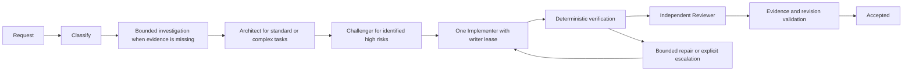
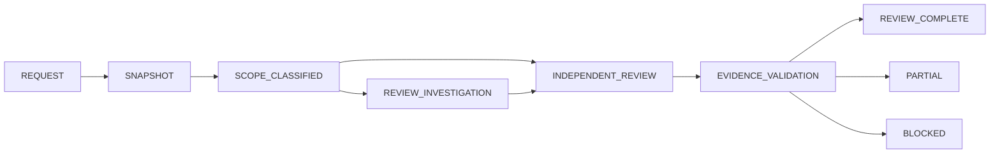

# Engineering Harness V2 architecture

English | [中文](architecture-v2.zh.md)

## Summary

This reference specifies V2 implementation requirements. The [implementation plan](implementation-plan-v2.md) orders delivery; the [acceptance matrix](acceptance-matrix-v2.md) defines acceptance. The existing [architecture](architecture.md) remains authoritative for deployed behavior until each phase is accepted.

## Workflows

Development and Review-only share repository identity, route policy, task admission, invocation receipts and durable artifacts. They have separate transitions and acceptance rules. Models cannot publish authoritative success.

Simple development omits unnecessary investigation and design calls but retains verification and an independent risk-appropriate check. Review-only never acquires a product-source writer lease or dispatches an Implementer.

## Roles and execution authority

A logical role selects deployment-configured routes. Each route names a provider, model, reasoning options, data allowance and tool permissions. Repository policy cannot inject credentials or silently override deployment routing. Existing environment-based route selection remains supported. No model identifier is embedded in workflow code.

A logical invocation can contain several physical model attempts. A model attempt can contain several provider requests, including retries and compaction. Each identity is recorded separately. FALLBACK changes route after a classified provider, protocol or output failure and quiescent shutdown. ESCALATE raises capability for insufficient evidence, repeated repair failure or a rejected design. Escalation resumes the affected diagnostic work instead of restarting completed work. Both mechanisms consume lifecycle budgets and have finite limits.

## Tool side effects and writer safety

Tool visibility, pre-execute policy, approval, monotonic guards, argument validation and cancellation must all succeed before mutation observation. A registry-owned synchronous body-start notification identifies the actual registered tool and its typed effect classification. Explicit read-only metadata permits read-only classification; omitted classification is potentially mutating. Read-only means no caller-workspace or external-system mutation; runtime cache and session bookkeeping may still change. Unknown or unavailable tools never reach body-start. Argument validation precedes body-start even for schema-defined tools. An around-dispatch wrapper that short-circuits cannot report mutation. Listener failure prevents dispatch; an observer must not hide a real side effect.

The engineering runtime associates observations with the exact child Agent, not tool names or parent IDs. Conservative mutation marking occurs immediately before a potentially mutating tool body, even if that body later fails. It does not claim that bytes were written. Shell remains potentially mutating and retains sandbox confinement. Tool registration and schema-validation errors cannot mark a body as started.

One task writer lease and repository-wide admission remain authoritative. Timeout requests cancellation, then awaits owned child and subprocess quiescence. Uncertain shutdown blocks fallback, recovery and admission of another writer. A settled failure after mutation remains fail-closed. Recovery requires explicit stop confirmation and a determinate workspace; abort alone is insufficient.

## Immutable Git evidence

At task creation, resolve repository realpath, target SHA and optional base SHA using fixed argv Git calls. Commit, latest-branch-commit, range and resolvable PR inputs all become immutable local commit identities. Branch movement cannot change evidence. Review tools expose snapshot, changed-files, diff, show and history operations only. Disable external diff and textconv; reject option injection, outside-root paths and unsupported object expressions. Read blobs from fixed commits rather than the changing worktree. Binary and truncated output report explicit completeness and pagination fields.

Evidence includes repository/snapshot identity, commit, path, new-version line range, operation and a verifiable content reference. Findings also require severity, failure condition, causal relation to the reviewed change and independently checkable evidence. Schema validity alone is insufficient. Deterministic validation checks locations, source content, snapshot identity and changed-line relation; independent review evaluates the claim. Empty findings require evidence of inspected scope. Unsupported claims, placeholder results and incomplete scope cannot produce REVIEW_COMPLETE. They produce PARTIAL or an insufficient-evidence reason.

## Bounded investigation and recovery

Each work unit names a question, allowed paths, tool limit, soft deadline, hard deadline and evidence format. Deployment configuration owns role defaults: Scout 90s/240s/40 calls, Architect 300s/480s/40, Challenger 180s/300s/30, Reviewer 300s/600s/50. Runtime enforcement stops new tools at the limit and requests cooperative cancellation at the hard deadline. Soft deadlines request a handoff; checkpoints contain only evidence actually obtained.

TaskRepository owns atomic checkpoints keyed by task, revision, snapshot and work-unit identity. Store evidence, unresolved questions, completion state, timestamps and attempt references. Reuse completed independent units; retry incomplete units with their valid partial evidence. Changed scope, dependency or snapshot invalidates the affected units. Compact role input includes relevant evidence references and deltas, never every historical artifact by default.

A task-lifecycle ledger survives engineering_recover and replanning. It accumulates logical invocations, model attempts, provider requests, tool calls, elapsed time, tokens and known estimated cost. Reserve capacity before dispatch, serialize concurrent updates and stop new scheduling as BUDGET_EXHAUSTED. Interrupted reservations remain consumed unless a durable record proves no request occurred. Missing historical usage is unknown, never zero.

## Acceptance and accounting

Development acceptance requires same-revision deterministic checks, independent review, validated evidence and no active writer. Review completion requires immutable scope coverage and validated review evidence, with no source write. Existing receipts and state transitions retain sole publication authority. No implementer self-report can satisfy verification.

Usage records bind task, role, invocation, attempt, request, route, provider and model. Preserve raw usage fields and distinguish input, cached-input, output and total tokens. Deduplicate by durable request/event identity; replay cannot charge again. Compaction has its own request identity. Wall time records actual attempt intervals; overlapping intervals are not summed into task elapsed time. Pricing requires versioned provider/model rates and cache semantics; absent reliable rates yields UNKNOWN. Estimated cost is never represented as a bill.

Offline fixtures establish lifecycle, injection, state and evidence behavior. Live route smoke establishes provider connectivity and protocol only. Full development and review E2E use independent deterministic oracles. Reproducible benchmarks compare strong single-agent, cheap single-agent, fixed multi-agent and adaptive V2 against identical snapshots, tasks and oracles. Report actual acceptance, first-pass rate, latency, tokens, known cost, failures, fallback, escalation and human intervention; unavailable live runs remain NOT_RUN.

## Phase 0 dispatch API decisions

defineTool exposes its captured parameter-schema validator as validateArguments; direct execute callers retain the same validation. The registry invokes it before body-start observation. Raw definitions without a validator use maintained full JSON Schema validation at dispatch, with compilation cached for immutable schema identity. Invalid or unresolved schemas fail closed before observation; no remote schema retrieval occurs. Arbitrary MCP schemas are not interpreted through the restricted output-schema subset. Raw invalid arguments that previously reached execute now fail before dispatch; document this public behavior change in an upgrade guide.

A scoped registry observer registration returns its exact effect disposer. Callbacks are synchronous and receive immutable execution identity and resolved effect metadata. Missing effect metadata means potentially mutating. Exceptions stop body invocation; callbacks cannot replace the resolved tool or its arguments. Recheck cancellation after callbacks. A callback that cancels after another callback marked potential mutation can conservatively retain that mark, but no body may execute. Observe each body retry separately. Scope disposal removes the observer.

Engineering children use the existing scoped presentation API: call `presentAs('native')` for each child before dispatch. A PTC-only composition fails with an actionable diagnostic. This does not add a presentation mode. Arbitrary run_code remains potentially mutating even when nested capabilities are read-only. Registry tests cover native bodies, nested PTC dispatch and conservative transport classification. Every existing engineering allowlisted read capability explicitly declares read-only effects in its owning definition; name matching never overrides an omitted effect declaration.
