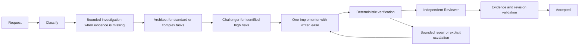
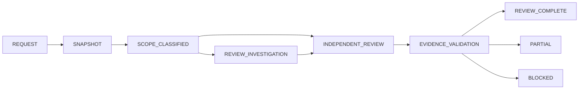

# Engineering Harness V2 架构

[English](architecture-v2.md) | 中文

## 概述

本参考文档规定 V2 的实现要求。[实现计划](implementation-plan-v2.zh.md)规定交付顺序；[验收矩阵](acceptance-matrix-v2.zh.md)定义验收标准。每个阶段通过验收之前，现有[架构](architecture.zh.md)仍是已部署行为的权威说明。

## 工作流

Development 和 Review-only 共用 repository identity、route policy、task admission、invocation receipt 和持久化产物。二者具有独立的状态转换和验收规则。模型不能发布权威成功状态。

简单开发会省略不必要的调查和设计调用，但仍会执行验证和与风险相称的独立检查。Review-only 不会获取产品源码 writer lease，也不会调度 Implementer。

## 自适应 Development 调度

Development 会根据显式范围、验收条件、配置策略和风险事实将 task 分为 simple、standard 或 complex。只有范围是有界的显式文件路径且验收条件完整时，task 才能归为 simple。同一 task 在恢复、策略变更或重新规划期间，分类和风险下限不得降低。Review-only 保留固定的变更文件范围，不能进入 Development。[自适应调度设计](adaptive-scheduling-v2.zh.md)定义分类规则、角色阶段、升级记录和 writer 诊断恢复。

Candidate-plan challenge 会根据 task 已确定的范围和验收条件检查提议计划。尚未运行的验证操作应记录在 `acceptanceGates` 或 `falsificationTests` 中；仅因 gate 待执行，不代表设计假设尚未解决，也不能单独阻止计划验收。只有当未知设计值可能改变方案选择或违反 task 约束时，才将该假设标记为阻断项。

## 角色与执行权限

逻辑角色选择由部署配置的 route。每个 route 指定 provider、model、reasoning 选项、数据许可和工具权限。repository policy 不能注入凭据，也不能悄然覆盖部署路由。继续支持现有的基于环境变量的 route 选择。工作流代码中不嵌入 model identifier。

一次逻辑调用可以包含多次物理 model attempt。一次 model attempt 可以包含多次 provider request，包括重试和压缩。每种身份都会单独记录。FALLBACK 在已分类的 provider、协议或输出失败且工作已完全停稳后切换 route。ESCALATE 在出现类型化的证据不足结果或持久化诊断义务后，使用单独配置且能力更高的 route。升级会继续受影响的工作，而不是重启已完成的工作；它消耗生命周期预算，并受持久化的有限次数限制。Writer 失败时，必须先持久化只读诊断义务，才能释放 writer lease；建议被持久化应用前，writer 仍不能启动。响应 envelope 和崩溃顺序见[自适应调度设计](adaptive-scheduling-v2.zh.md)。

## 工具副作用与 writer 安全

工具可见性、pre-execute policy、approval、monotonic guard、参数验证和取消都成功后，才能观察到 mutation。由 registry 拥有的同步 body-start 通知会标识实际注册的工具及其类型化 effect 分类。显式只读元数据允许归类为只读；未提供分类时按可能产生 mutation 处理。只读表示不会修改调用方 workspace 或外部系统；runtime cache 与 session bookkeeping 仍可变化。未知或不可用的工具不会到达 body-start。即使工具定义了 schema，也会先验证参数，再触发 body-start。提前短路的 around-dispatch wrapper 不会报告 mutation。listener 失败会阻止 dispatch；observer 不得掩盖真实副作用。

Engineering runtime 将观察结果关联到确切的子 Agent，而不是工具名或 parent ID。可能产生 mutation 的工具 body 即将执行时会立即进行保守标记，即使该 body 随后失败也一样。该标记不表示已经写入字节。Shell 仍按可能产生 mutation 的工具处理，并继续受沙箱约束。工具注册错误和 schema 验证错误不会标记 body 已开始。

一个 task writer lease 和 repository-wide admission 仍是权威机制。超时会请求取消，然后等待其拥有的 child 和 subprocess 完全停稳。关停状态不确定时会阻止 fallback、恢复和另一个 writer 的准入。mutation 之后已结算的失败仍会 fail closed。恢复需要明确确认工作已停止，且 workspace 状态确定；仅中止操作并不足够。

## 不可变 Git 证据

创建 task 时，使用固定 argv 的 Git 调用解析 repository realpath、target SHA 和可选的 base SHA。commit、latest-branch-commit、range 和可解析的 PR 输入都会转换为不可变的本地 commit identity。分支移动不会改变证据。Review 工具只提供 snapshot、changed-files、diff、show 和 history 操作。禁用 external diff 和 textconv；拒绝选项注入、根目录外路径和不支持的对象表达式。从固定 commit 读取 blob，而不是从不断变化的 worktree 读取。二进制和截断输出会明确报告完整性与分页字段。

证据包含 repository/snapshot identity、commit、路径、新版本行号范围、操作和可验证的内容引用。Finding 还必须包含严重级别、失败条件、与被评审变更的因果关系，以及可独立检查的证据。仅有 schema 有效性并不足够。确定性验证会检查位置、源码内容、snapshot identity 和与变更行的关系；独立评审会判断主张。空 findings 必须提供已检查范围的证据。无法支持的主张、占位结果和不完整范围都不能产生 REVIEW_COMPLETE；它们会产生 PARTIAL 或证据不足原因。

## 有界调查与恢复

每个工作单元都要命名一个问题、允许路径、工具调用上限、软时限、硬时限和证据格式。部署配置拥有角色默认值：Scout 90s/240s/40 次调用，Architect 300s/480s/40 次，Challenger 180s/600s/30 次，Reviewer 300s/600s/50 次。Runtime 会在达到上限时停止新工具调用，并在硬时限到达时请求协作式取消。软时限会请求交接；checkpoint 只包含实际取得的证据。

TaskRepository 按 task、revision、snapshot 和 work-unit identity 原子保存 checkpoint。存储证据、未解决问题、完成状态、时间戳和 attempt 引用。复用已完成的独立单元；重试未完成单元时附带仍有效的部分证据。范围、依赖项或 snapshot 变化会使受影响的单元失效。精简后的角色输入包含相关证据引用和增量内容，默认不包含所有历史产物。

task-lifecycle ledger 会在 engineering_recover 和重新规划后继续存在。它累计逻辑调用、model attempt、provider request、tool call、耗时、token 和已知的估算成本。dispatch 前预留容量，并串行更新；达到上限后停止新调度，状态为 BUDGET_EXHAUSTED。除非持久化记录证明请求未发生，否则中断的预留仍计入已用额度。缺失的历史用量视为未知，绝不视为零。

## 验收与用量核算

Development 验收要求相同 revision 的确定性检查、独立评审、已验证的证据且没有活动 writer。Review 完成要求不可变范围覆盖和已验证的评审证据，并且没有源码写入。现有 receipt 和状态转换仍是唯一的发布权威。Implementer 的自述不能满足验证要求。

用量记录绑定 task、role、invocation、attempt、request、route、provider 和 model。保留原始用量字段，并区分 input、cached-input、output 和 total token。按持久化 request/event identity 去重；回放不能重复计费。压缩具有独立的 request identity。Wall time 记录实际 attempt 区间；重叠区间不会累加成 task 总耗时。成本估算需要带版本的 provider/model 价格和缓存语义；缺少可靠价格时结果为 UNKNOWN。估算成本绝不表示为账单。

在线实现对比在隔离 fixture 的规范 repository cwd 中，通过 harness 拥有的空闲 AgentHandle 分派每种策略。Harness 保留原始 coordinator delegation depth、preset 和 policy；carrier 不会收到 prompt。Role executor 检查 Session cwd 与 invocation root 一致；fixture teardown 等待 executor disposal 完成。Development 使用真实 TaskRepository 和 verification profile；只有 supervisor 持有 writer token，且必须等 child work 静止后才释放。Review 只使用不可变 Git evidence，不创建 Development state。plan 和 oracle 的细节见[评估设计](usage-evaluation-v2.zh.md)。

离线 fixture 建立生命周期、注入、状态和证据行为。在线 route smoke 只验证 provider 连通性和协议。完整的 development 和 review E2E 使用独立的确定性 oracle。可复现的 benchmark 使用相同 snapshot、task 和 oracle 比较 strong single-agent、cheap single-agent、fixed multi-agent 和 adaptive V2。报告实际验收、首次通过率、延迟、token、已知成本、失败、fallback、升级和人工干预；无法进行的在线运行标记为 PARTIAL 或 NOT_RUN。[Phase 4 用量核算与评估设计](usage-evaluation-v2.zh.md)规定了 ledger 和 benchmark 证据。

## Phase 0 dispatch API 决策

defineTool 将其捕获的参数 schema 验证器公开为 validateArguments；直接 execute 调用方仍执行相同验证。Registry 会在 body-start observation 前调用该验证器。没有验证器的原始定义使用 Ajv 默认的 Draft 7 JSON Schema dialect 并执行严格 schema 校验。编译结果按每个 definition 当前 schema 快照的序列化内容缓存。不支持的关键字、format、dialect 和无法解析的引用都会在 observation 前失败；不会远程获取 schema。不会使用受限的 output-schema 子集解释任意 MCP schema。此前会传入 execute 的原始无效参数现在会在 dispatch 前失败；应在 upgrade guide 中记录此公开行为变更。

注册 scoped registry observer 会返回其准确的 effect disposer。回调是同步的，并接收不可变的执行 identity 和已解析的 effect metadata。缺少 effect metadata 时按可能产生 mutation 处理。回调异常会阻止 body 调用；回调不能替换已解析的工具或其参数。回调后重新检查取消。如果一个回调取消操作，而另一个回调已标记可能产生 mutation，则可以保守地保留该标记，但不得执行 body。每次 body retry 都分别观察。Scope dispose 时移除 observer。

Engineering child 使用现有的作用域呈现 API：在 dispatch 前对每个 child 调用 `presentAs('native')`。PTC-only composition 会得到可操作的诊断。这不会新增呈现模式。即使嵌套能力只读，任意 run_code 仍按可能产生 mutation 处理。Registry 测试覆盖 native body、嵌套 PTC dispatch 和保守的 transport 分类。每个现有的 engineering allowlist 只读能力都要在其定义中显式声明只读 effect；工具名匹配不得覆盖缺失的 effect 声明。
